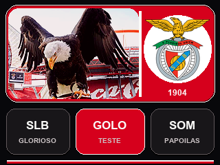

# Benfica CYD Desk Buddy

Proyecto de sobremesa para la pantalla táctil **Freenove FNK0114L / E32R32P de
3,2 pulgadas**. Reúne una interfaz inspirada en el Benfica, audio local,
información deportiva por Wi-Fi y una carcasa imprimible en 3D.



## Funciones

- Interfaz táctil de cuatro páginas con transiciones horizontales.
- Escudo, águila animada, `SLB GLORIOSO` y `PAPOILAS SALTITANTES`.
- Próximo partido, marcador, goleadores y clasificación portuguesa.
- Detección de partidos de Liga, Champions y otras competiciones.
- Himno con letra sincronizada.
- Reproducción autónoma desde microSD y altavoz de 8 ohmios.
- Configuración del Wi-Fi desde el móvil, sin guardar contraseñas en el código.
- Carcasa Rev. G para imprimir en una Bambu Lab A1 u otra impresora FDM.

## Antes de empezar

Este firmware está ajustado para el modelo exacto `FNK0114L_3P2` con ESP32
clásico, pantalla ST7789 de 240x320 y el amplificador integrado de esa placa. No
se debe cargar sin adaptar los pines en otras variantes de CYD.

Consulta primero:

1. [Instalación y copia en otra CYD](docs/INSTALACION.md)
2. [Esquema de conexiones](docs/CONEXIONES.md)
3. [Preparación de la microSD](sdcard/README.md)
4. [Impresión y montaje de la carcasa](hardware/enclosure/README.md)

## Instalación resumida

1. Formatea una microSD como FAT32 y copia en su raíz la carpeta
   `sdcard/Benfica`.
2. Instala ESP32 Arduino **2.0.11**, ArduinoJson **7.4.2**, ESP8266Audio
   **2.0.0** y la edición de `TFT_eSPI` suministrada por Freenove.
3. Comprueba que `TFT_eSPI` tiene seleccionado
   `FNK0114L_3P2_240x320_ST7789`. En `extras/TFT_eSPI_Setups` se conserva la
   configuración exacta utilizada en este proyecto.
4. Abre `firmware/BenficaCYD/BenficaCYD.ino` en Arduino IDE.
5. Selecciona `ESP32 Dev Module` y la partición
   `Huge APP (3MB No OTA/1MB SPIFFS)`.
6. Sube el programa por USB.
7. En el primer inicio, conéctate desde el móvil a `Benfica-CYD-Setup`, abre
   `http://192.168.4.1` y configura el Wi-Fi de casa.

## Estructura del repositorio

```text
firmware/BenficaCYD/     Sketch, imágenes integradas, fuente y herramientas
sdcard/Benfica/          Archivos que deben copiarse a la tarjeta FAT32
hardware/enclosure/      STL, proyectos 3MF, Blender y scripts de la carcasa
docs/                    Instalación detallada y conexiones
extras/                  Configuración de TFT_eSPI usada durante el desarrollo
```

## Estado de la información deportiva

La interfaz y el audio funcionan sin ordenador. Los últimos datos válidos se
guardan en el ESP32 y se muestran inmediatamente al encenderlo. La consulta
directa a los servidores públicos de ESPN no es una API oficial para este
proyecto y puede responder de manera intermitente, especialmente al descargar
la clasificación completa. El firmware conserva la caché anterior cuando una
consulta falla.

Una CYD recién programada no contiene esa caché: mostrará `A ATUALIZAR` hasta
que consiga una primera actualización válida. Para fabricar varias unidades y
garantizar actualizaciones estables se recomienda añadir en el futuro un
pequeño intermediario web con una respuesta JSON reducida.

## Licencias y marcas

El código y la documentación propios se publican bajo la licencia MIT incluida
en este repositorio. La fuente Graduate conserva su licencia OFL.

Este es un proyecto de aficionados, no oficial y no afiliado con Sport Lisboa e
Benfica, Freenove ni ESPN. Sus nombres, escudos, marcas, imágenes, canciones y
grabaciones pertenecen a sus respectivos titulares y no quedan cubiertos por la
licencia MIT. Antes de redistribuir o vender una unidad, sustituye cualquier
recurso para el que no tengas permiso de distribución.

